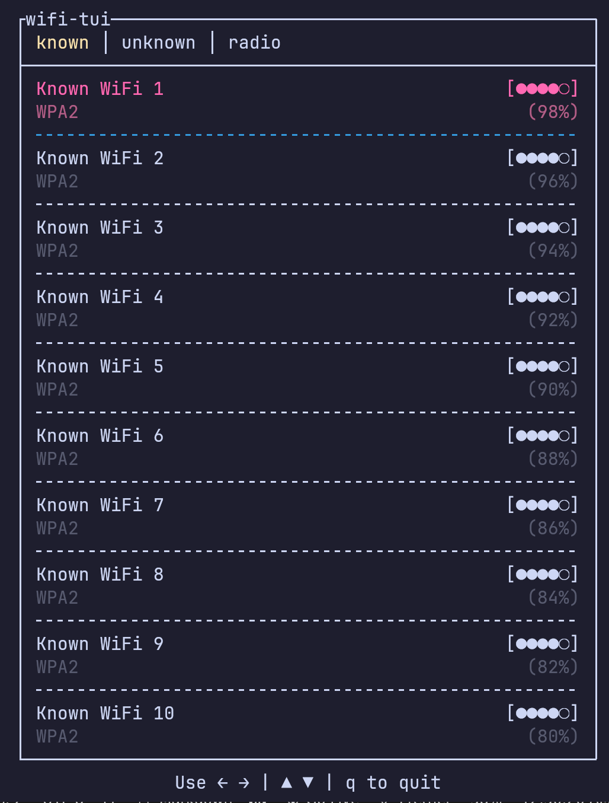
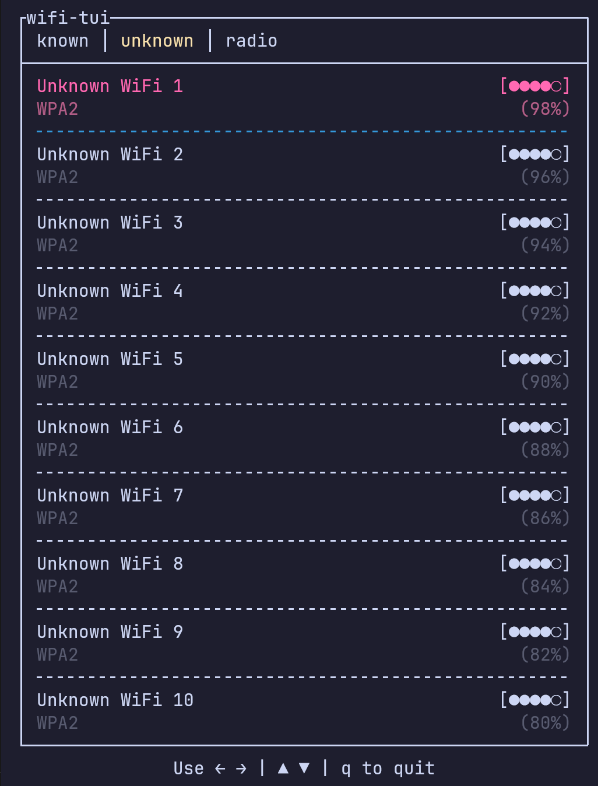
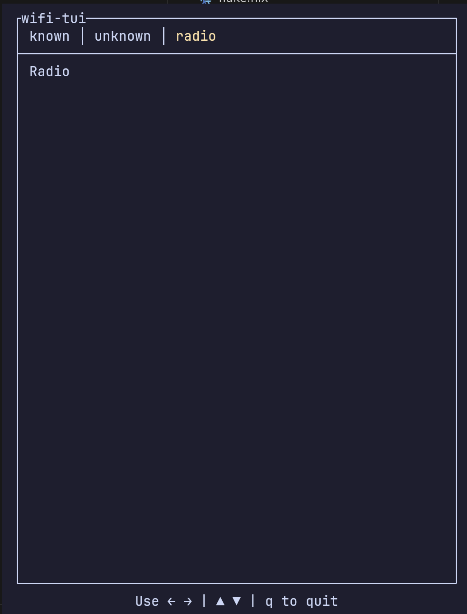

# wifi-tui

Aim is to have a simple and minimal TUI to manage WiFi connections on Linux. This is useful in WMs like i3 and sway **and** the user wants to embrace the terminal for everything.

## Features

- When I open the app, I want to see a list of available WiFi networks.
- when I focus on a network, I want to be able to select keys such as
  - `enter` to connect to the network if it is known or to prompt for a password if it is not known.
  - `d` to delete the network
  - `e` to edit the network

That's about it. That's all the functionality I found myself using in the last 4 months of using `nmcli` to manage my WiFi connections.

## Screenshots

### TODOs

Click to expand

- [ ] Add a throbber in the right corner of the tab box
- [ ] Add inputs to enable/disable the radio like in nmtui
- [x] only if the tab changes. not if its in the same tab after key press

